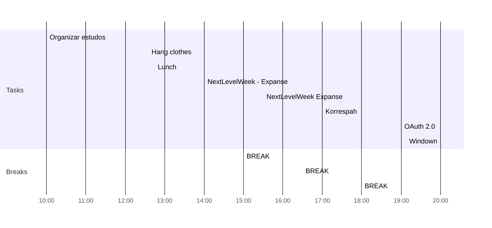

# Day Planner

## Before midday
- [x] 10:00 Organizar estudos

## After midday
- [x] 12:35 Hang clothes
- [x] 12:45 Lunch
- [x] 14:00 NextLevelWeek - Expanse
- [x] 15:00 BREAK
- [x] 15:30 NextLevelWeek Expanse
- [x] 16:30 BREAK
- [x] 17:00 Korrespah
- [ ] 18:00 BREAK
## After dusk
- [ ] 19:00 OAuth 2.0
- [ ] 20:00 Windown