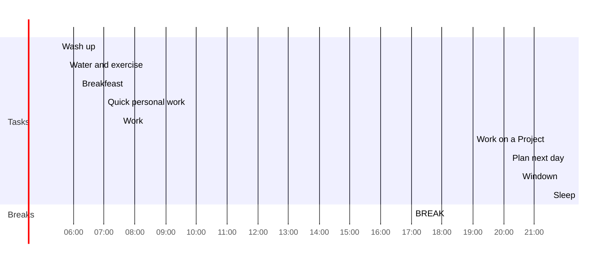

# Day Planner

## Before work - *2h*
- [x] 05:30 Wash up
- [x] 05:45 Water and exercise
- [x] 06:10 Breakfeast
- [x] 07:00 Quick personal work
---
## Work - *10h*
- [x] 07:30 Work
- [x] 17:00 BREAK
---
## After work - *2h*
- [ ] 19:00 Work on a Project
- [ ] 20:10 Plan next day
- [ ] 20:30 Windown
- [ ] 21:30 Sleep