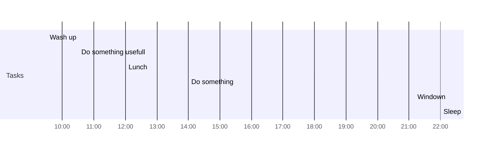

# Day Planner

```mermaid
gantt
    dateFormat  HH-mm
    axisFormat %H:%M
    %% Current Time: 8:16:19 PM
    section Tasks
    Wash up     :09-30, 60mm
    Do something usefull     :10-30, 90mm
    Lunch     :12-00, 120mm
    Do something     :14-00, 430mm
    Windown     :21-10, 50mm
    Sleep     :22-00, 0mm
    section Breaks

```

## Before midday
- [x] 09:30 Wash up
- [x] 10:30 Do something usefull

## After midday
- [x] 12:00 Lunch
- [ ] 14:00 Do something
- [ ] 21:10 Windown
- [ ] 22:00 Sleep