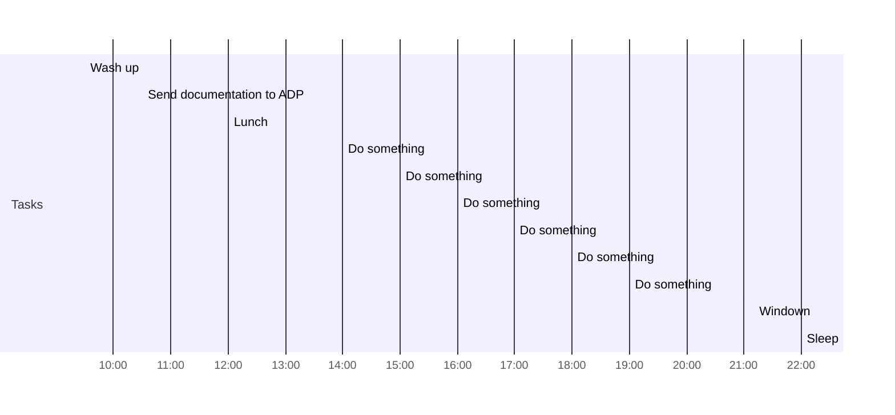

# Day Planner

## Before midday
- [x] 09:30 Wash up
- [x] 10:30 Send documentation to ADP

## After midday
- [ ] 12:00 Lunch
- [ ] 14:00 Do something
- [ ] 15:00 Do something
- [ ] 16:00 Do something
- [ ] 17:00 Do something
- [ ] 18:00 Do something
- [ ] 19:00 Do something
- [ ] 21:10 Windown
- [ ] 22:00 Sleep